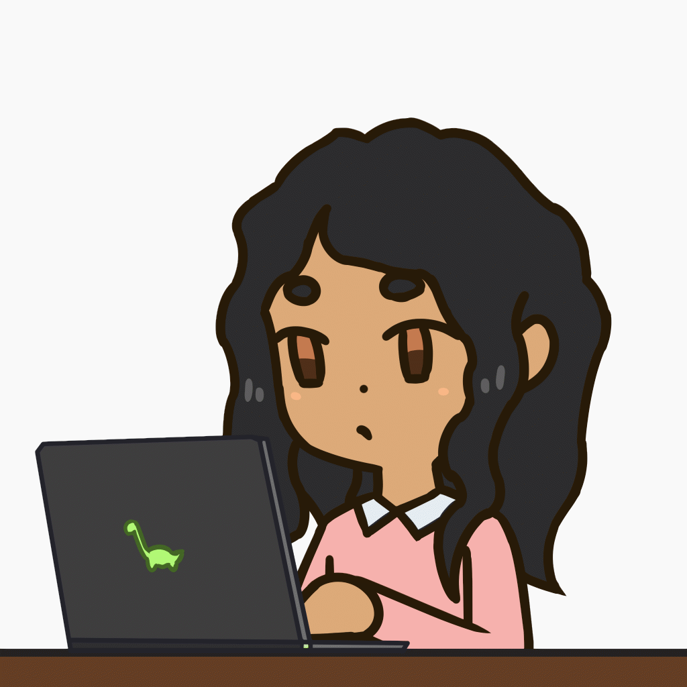

<h1 align="center">Hi, I'm Oumayma Limeme 👋</h1>
<h3 align="center">Full-Stack Developer • Based in Germany 🇩🇪</h3>

---

## 👩🏻‍💻 About Me

🎓 I hold a **Master's degree in Software Engineering** from **ENICarthage (National Engineering School of Carthage)**, Tunisia 🇹🇳

💼 Currently working as a **Software Engineer** at **Unishere GmbH**, Germany 🇩🇪 building innovative solutions in a dynamic international environment.

🚀 I'm passionate about crafting **performant, secure, and scalable** web and mobile applications — from robust backend APIs to polished, user-friendly UIs.

🧠 Continuously growing in:
- **Full‑Stack Development:** React, Angular, VueJs, React Native, FastApi, Node.js
- **DevOps & CI/CD automation**
- **Cloud infrastructure**

💡 I love solving real-world problems, optimizing system performance, and turning ideas into production-ready solutions.

🤝 Open to collaboration, mentorship, and exciting engineering challenges.

---

## 🚀 Stats

  

  

---

## 📊 GitHub Stats

  
  

  

---

## 🚀 Get in touch

  
  
  
  

  
  
  

